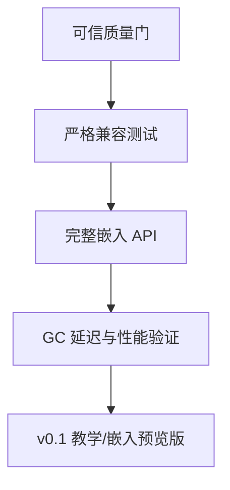

截至 2026 年 7 月 12 日，我对 `main@794e480` 的判断是：

> 仓库已经从“解释器功能实现期”进入“兼容性证据、嵌入能力与工程可信度建设期”。
> 继续扩展普通语法或 VM 功能的边际收益已经很低，下一阶段应优先证明它、嵌入它、稳定它。

如果按不同定位评分：

| 定位                            |  当前成熟度 | 判断                  |
| ----------------------------- | -----: | ------------------- |
| 现代 C++ 解释器教学项目                | 8.5/10 | 已接近标杆级              |
| Lua 5.1 语义研究平台                |   8/10 | 核心链路完整              |
| 可嵌入游戏服务器的 Lua Runtime         |   6/10 | C API、GC 延迟和跨平台验证不足 |
| Lua 5.1.5 drop-in replacement |   5/10 | 目前不应宣称完整兼容          |

## 一、仓库当前实际状态

主分支最新提交是 [794e480：Streamline technical encyclopedia](https://github.com/YanqingXu/lua/commit/794e480eb73135f8e0e3f3a75f7b85fa7f7f1233)，最近两次提交主要是文档整理，没有解释器语义层的大规模变化。

[PR #2](https://github.com/YanqingXu/lua/pull/2) 已合并，完成了非常有价值的文档治理：

* 删除 `docs2` 和重复、过期、相互矛盾的文档。
* `docs/` 只保留技术实现百科。
* 建立 Compiler、VM、Runtime、GC、stdlib、compatibility、testing、source map 的唯一权威入口。
* 最近记录的绿跑为 668 个测试、3406 个断言、0 失败。

当前架构完整度已经比较高：

* Lexer、Parser、AST、CodeGen 链路完整。
* 38 条 Lua 5.1 风格 opcode 均有实现。
* `Value` 与 `ValueResult` 使用 `std::variant` 建模。
* Parser、CodeGen、VM 边界已经应用 `std::expected`。
* VM handler、调用栈、RuntimeServices、EngineContext 已经拆分。
* 标准库覆盖 base、math、string、table、io、os、coroutine、debug、package。
* GC 已覆盖三色标记、弱表、userdata finalizer、写屏障和分阶段 step。
* `lua_bytecode`、REPL、trace、文档—源码—测试映射形成了完整教学闭环。

这些结论可从 [README](https://github.com/YanqingXu/lua/blob/main/README.md)、[源码责任映射](https://github.com/YanqingXu/lua/blob/main/docs/knowledge/source-document-map.md) 和 [CMake 构建清单](https://github.com/YanqingXu/lua/blob/main/CMakeLists.txt) 交叉验证。

## 二、当前最重要的几个问题

### 1. “官方套件 skip=0”不等于严格 Lua 5.1 全兼容

这是目前最值得修正的项目表述。

[官方套件测试入口](https://github.com/YanqingXu/lua/blob/main/tests/unit/official/test_official_suite.cpp) 的确把 `kExpectedSkippedScripts` 设置为 0，skip 表也是空的，但测试 harness 同时做了这些处理：

* 修改 `constructs.lua` 的压力循环。
* 缩小 `closure.lua` 的闭包和弱表压力规模。
* 限制 `gc.lua` 的自动 GC 等待循环。
* 主 `all.lua` 流程只执行到 `vararg.lua`。
* 后续脚本拆成单独的 tail smoke。
* “closure + global cleanup”已知缺口测试只检查测试源码是否包含标记，并没有真正执行该组合。
* 没有注入官方 `testC` 的 `T` 模块，因此 `api.lua`、`code.lua` 中依赖 testC 的路径并没有形成严格验证证据。

所以更准确的表达应该是：

> “Lua 5.1 官方套件 staged smoke 在受控改写和压力缩减条件下通过，外部 skip 表为 0；尚未达到 upstream 原样全量执行。”

### 2. 质量门存在“子命令失败但总脚本仍可能成功”的风险

当前 [run_quality_gate.ps1](https://github.com/YanqingXu/lua/blob/main/tools/run_quality_gate.ps1) 调用 `powershell`、MSBuild、测试程序等 native/external command 后，没有统一检查 `$LASTEXITCODE`。

PowerShell 的 `$ErrorActionPreference = "Stop"` 并不能可靠地把所有 native 非零退出码转换成异常。

已经关闭但未合并的 [PR #1](https://github.com/YanqingXu/lua/pull/1) 实际上包含了正确修复：

* 每个质量门步骤清零并检查 `$LASTEXITCODE`。
* 将 opcode matrix 变成机器可验证的 coverage contract。
* 将 C-style 数量白名单升级为“路径、行、文本 hash、理由”基线。
* 验证 coverage contract 引用的测试 ID 是否真实注册。

建议把 PR #1 的工具链改动重新移植到最新主分支，但不要整体 cherry-pick，因为它的旧文档修改会和 PR #2 的新百科结构发生冲突。

### 3. CI 覆盖面明显落后于代码成熟度

当前 [GitHub Actions CI](https://github.com/YanqingXu/lua/blob/main/.github/workflows/ci.yml) 只有：

* `windows-latest`
* MSVC Debug x64
* 文档漂移检查
* 质量门 smoke
* 单元测试
* 显式 `-SkipClangTidy`

缺少：

* Windows Release。
* Ubuntu GCC/Clang + CMake/CTest。
* ASan、UBSan。
* 真正执行的 clang-format、clang-tidy。
* Debug/Release 行为一致性验证。
* 严格官方 Lua 5.1 compatibility lane。

对于 VM、GC、裸 observer 指针较多的项目，ASan/UBSan 的优先级非常高。TSan 可以稍后再做，因为当前解释器核心并不是多线程共享执行模型。

### 4. C API 仍然只是“可演示子集”

当前 [lua.h](https://github.com/YanqingXu/lua/blob/main/src/lua.h) 只声明约 34 个核心 API，[lauxlib.h](https://github.com/YanqingXu/lua/blob/main/src/lauxlib.h) 只有约 8 个辅助 API。

更关键的是，[lapi.cpp](https://github.com/YanqingXu/lua/blob/main/src/api/lapi.cpp) 中存在明确语义缺口：

* `lua_newstate(lua_Alloc, void*)` 当前忽略自定义 allocator 和 userdata。
* `lua_pushcclosure(..., int n)` 忽略 `n`，没有真正捕获栈顶 C upvalue。
* `lua_createtable(narr, nrec)` 忽略容量提示。
* 缺少完整的 load/dump、userdata/metatable、registry、thread/coroutine 等接口族。
* 尚不能作为已有 Lua 5.1 C/C++ 模块的直接替代运行时。

对于你的游戏服务器研究方向，C API 的实际价值高于继续增加 REPL 展示功能。

### 5. Incremental GC 仍带有教学近似性质

[GC 实现文档](https://github.com/YanqingXu/lua/blob/main/docs/gc/implementation.md) 已经很诚实地说明：

* `collectgarbage("step")` 有 pause/propagate/atomic/sweep/finalize 分阶段状态机。
* 写屏障、弱表、终结器路径已经建立。
* 但工作量和 debt 计算是项目本地近似。
* `IncrementalGC` 对完整 `collect()` 仍保持完整 mark-sweep 语义。

这已经是很好的教学实现，但如果目标是用于游戏服务器，需要增加“最大暂停时间、单步预算、分配吞吐、堆增长曲线”验证，不能只验证最终可达性正确。

## 三、建议的下一阶段主方向

我建议把下一阶段命名为：

> **Lua 5.1 Compatibility Evidence & Embedding Milestone**

不要再以“完成更多功能”为中心，而应形成以下闭环：

### P0：修复工程证据链，预计 1～2 周

优先完成：

1. 从 PR #1 移植 `$LASTEXITCODE` 传播修复。
2. 引入机器可读的 opcode coverage contract。
3. 将 C-style count 白名单改成位置基线。
4. CI 增加 Ubuntu Clang/GCC、CMake/CTest。
5. 增加 ASan、UBSan lane。
6. CI 中真正执行 clang-format 和 clang-tidy。
7. 为 `main` 设置必须通过的分支保护检查。

验收标准：

* 任意子脚本或测试返回非零，整个 CI 必须失败。
* 38 个 opcode 的 producer、handler、测试 ID 都能机器校验。
* 新增或移动裸指针/C 风格模式必须显式更新理由，而不是消耗数量额度。

### P1：建立严格兼容性双通道，预计 2～4 周

把官方套件拆成两个明确通道：

* `official-smoke`：保留当前缩减压力、快速执行的 staged smoke。
* `official-strict`：不修改 upstream Lua 文件，不截断 `all.lua`，不缩短循环。

然后：

1. 将所有源代码改写记录成明确的 compatibility deviation。
2. 接入 `testC`/`T` 模块，真正执行 `api.lua`、`code.lua` 的测试路径。
3. 真正执行 closure + global cleanup 已知缺口。
4. 单独运行 slow suite，如 `sort.lua`、`verybig.lua`。
5. 建立官方 Lua 5.1 与本解释器的 differential runner：

   * stdout
   * stderr
   * exit status
   * 返回值类型
   * 错误类别
   * GC 可观察副作用

验收标准不是“0 skip”，而是：

* upstream 原样通过多少。
* XFAIL 多少。
* 每个 XFAIL 是否有 issue、最小复现和责任模块。

### P2：完成可嵌入 C API MVP，预计 4～6 周

建议优先级：

1. `lua_newstate` allocator 语义。
2. C closure upvalue。
3. userdata、metatable、registry。
4. `lua_load`、`luaL_loadbuffer`、`luaL_loadfile`。
5. `lua_dump` 与项目内部 chunk API。
6. coroutine：`lua_newthread`、`lua_resume`、`lua_yield`、`lua_status`。
7. C API 栈不变量和异常边界测试。
8. 编写一个真实 C++ embedding example。

对于游戏服务器用途，我建议：

> 先完成 C API 和多 Runtime 隔离，再考虑官方 `luac` binary chunk 字节级兼容。

### P3：游戏服务器场景的运行时验证，预计 2～4 周

增加专门 benchmark：

* 脚本解析与编译吞吐。
* 每秒 VM 指令数。
* C++ → Lua、Lua → C++ 调用成本。
* coroutine resume/yield 成本。
* table 高频读写。
* 10 万闭包/upvalue 生命周期。
* 每帧固定 GC budget 下的 P50/P95/P99 pause。
* 长时间运行后的堆稳定性。

这会让项目从“解释器实现”真正向“游戏服务器脚本运行时实验平台”升级。

## 四、我建议你现在立即做的第一批任务

按执行顺序：

1. 移植 PR #1 的质量门退出码修复。
2. 移植 C-style 位置基线与 opcode contract。
3. 创建 `official-smoke` / `official-strict` 两套测试入口。
4. 禁止 strict lane 改写官方 Lua 源文件。
5. 将 closure + global cleanup 变成真正执行的失败测试。
6. 接入 `testC/T`，恢复 `api.lua`、`code.lua` 的完整路径。
7. 增加 Linux + ASan/UBSan CI。
8. 创建 `v0.1-embedding-preview` milestone，开始补 C API。

最终建议是：保留“现代 C++ 教学标杆”作为项目核心特色，但下一阶段不要继续扩充百科或普通功能，而要把已有成果变成可验证、可嵌入、可发布的运行时。
