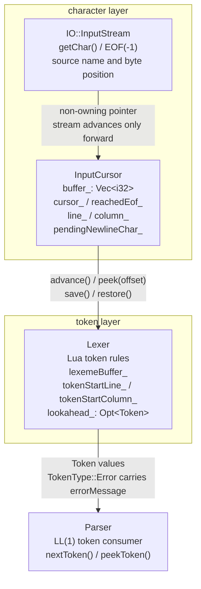
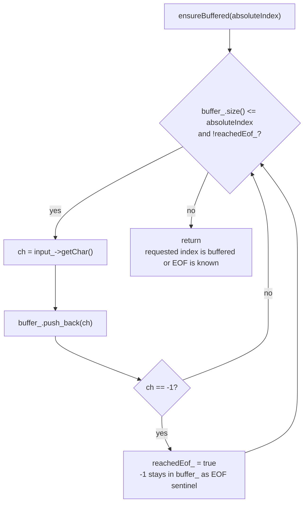
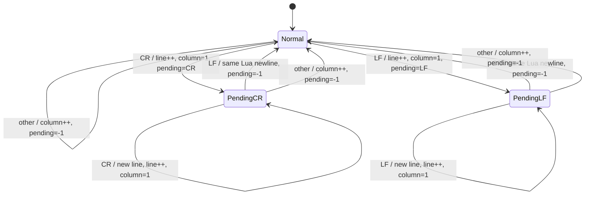
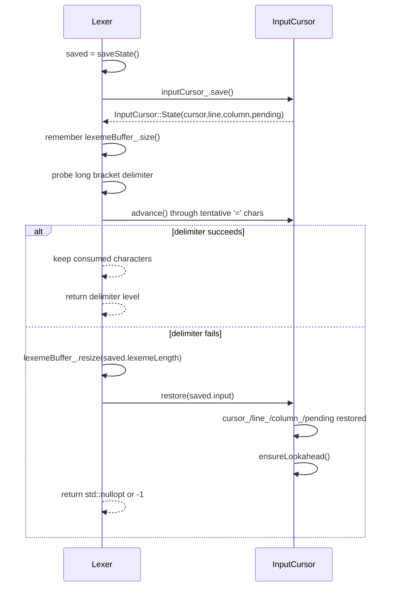
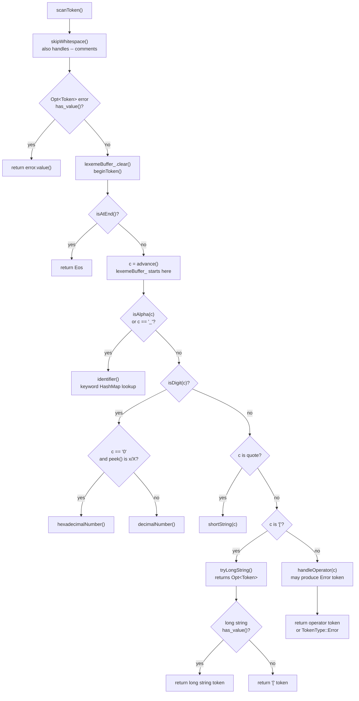
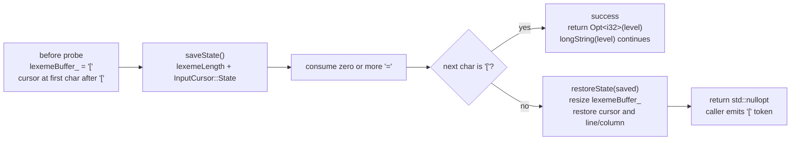

# Lua 词法分析器实现说明

本文档说明当前 `src/compiler/lexer/lexer.hpp`、`src/compiler/lexer/lexer.cpp`、`src/compiler/lexer/lexer_cursor.hpp` 和 `src/compiler/lexer/lexer_cursor.cpp` 的职责边界、扫描流程和 Lua 5.1 语义实现。项目当前以 Windows / MSBuild 为主要构建路径，CMake 作为辅助构建与测试路径；源码目标使用 C++23 标准，但这里的 lexer 主要依赖 C++17 已有的 `std::optional`、`std::string_view`、智能指针和类型安全枚举等设施。

## 1. 文件与职责边界

| 文件 | 当前职责 |
|---|---|
| `src/compiler/parser/token.hpp` | 定义 `TokenType`、`TokenValue` 和 `Token`。单字符 token 直接复用 ASCII 值，多字符 token 从 257 开始，避免和字符 token 冲突。 |
| `src/compiler/lexer/lexer_cursor.hpp` | 声明 `InputCursor`，负责输入字符缓冲、字符级 lookahead、回放状态和行列号维护。 |
| `src/compiler/lexer/lexer_cursor.cpp` | 实现 `InputCursor::advance()`、`peek()`、`save()`、`restore()`、`ensureBuffered()` 等输入游标操作。 |
| `src/compiler/lexer/lexer.hpp` | 声明 `Lexer` 的 public token API、扫描 helper、局部回溯状态 `LexerState` 和输入生命周期成员。 |
| `src/compiler/lexer/lexer.cpp` | 实现 Lua 5.1 token 扫描：空白与注释跳过、关键字、数字、字符串、长字符串、运算符、错误 token 和 token 级预读。 |

这个拆分的核心目标是把“字符输入状态”和“词法规则状态”分开：`InputCursor` 不理解 Lua token，只负责稳定地给出字符；`Lexer` 不直接管理底层 stream offset，只通过 `advance()`、`peek()`、`peekNext()` 组合 Lua 词法规则。



上图里的边界是当前实现最重要的维护约束：`InputCursor` 只处理字符、缓冲、EOF 哨兵和行列号；`Lexer` 只处理 Lua 词法规则、lexeme 累积、错误 token 和 token 级 `std::optional` 缓存。

## 2. InputCursor：字符缓冲、预读和回放

`InputCursor` 是当前 lexer 的字符层基础设施。它持有一个非拥有的 `IO::InputStream* input_`，并把已经读过的字节保存到 `Vec<i32> buffer_` 中。缓冲元素使用 `i32` 而不是 `char`，是为了保留 `InputStream::getChar()` 的 `-1` EOF 哨兵；这能把真实输入中的 NUL 字节 `0` 和 EOF 区分开。

关键成员如下：

- `buffer_`：已经从 `InputStream` 拉取的字符缓存，包含 EOF 哨兵。
- `cursor_`：当前读取位置，是 `buffer_` 的绝对下标。
- `reachedEof_`：底层输入是否已经读到 EOF。
- `line_` / `column_`：当前游标位置对应的 1-based 行列号。
- `pendingNewlineChar_`：用于把 CRLF 和 LFCR 识别为单个 Lua 换行。

### 2.1 字符级 lookahead

`InputCursor::ensureBuffered(absoluteIndex)` 会从 `input_` 读取字符，直到 `buffer_` 覆盖指定下标，或已经读到 EOF。`ensureLookahead()` 固定调用 `ensureBuffered(cursor_ + 1)`，因此 cursor 初始化和每次 `advance()` 后都会至少保证“当前字符 + 下一个字符”可见。

`InputCursor::peek(offset)` 只查看 `cursor_ + offset`，不推进游标。若目标位置是 EOF 哨兵或暂不可见，则返回 `'\0'`。调用者不能仅用 `peek() == '\0'` 判断 EOF，因为真实 NUL 字节也会表现为 `'\0'`；正确判断方式是 `InputCursor::isAtEnd()` / `Lexer::isAtEnd()`。当前测试用真实 NUL 字节锁住了这条边界。



`ensureLookahead()` 是这个流程的一个固定调用点：它传入 `cursor_ + 1`，让 `peek()` 和 `peekNext()` 的常见路径不需要再次触碰底层流。这里的“预读”不是异步或阻塞式后台读取，而是按需同步填充内存缓冲；底层 `InputStream` 仍然只被动地向前提供字符。

`Lexer` 在字符层只暴露三种操作：

- `Lexer::advance()`：调用 `inputCursor_.advance()`，并把字符追加到 `lexemeBuffer_`。
- `Lexer::peek()`：查看当前字符。
- `Lexer::peekNext()`：查看下一个字符。

因此 token 规则无需直接接触底层输入流，也不会把 EOF 和普通字符的生命周期判断散落到各处。

### 2.2 行列号维护

`InputCursor::advance()` 是行列号变化的唯一入口。普通字符会使 `column_++`；换行字符会使 `line_++` 并把 `column_` 重置为 1。

Lua 5.1 把 CRLF 和 LFCR 都视为一个换行。当前实现用 `pendingNewlineChar_` 表达“刚刚消费了一个换行字符，下一次如果遇到另一种换行字符，它是同一个换行序列的后半段”。规则是：

- 第一次遇到 `'\r'` 或 `'\n'`：增加行号，列号回到 1，并记录该换行字符。
- 紧接着遇到另一种换行字符：不再次增加行号，只清除 pending 状态。
- 遇到普通字符：列号增加，并清除 pending 状态。

这使 `a\r\nb\n\rc` 中的 `b` 位于第 2 行第 1 列，`c` 位于第 3 行第 1 列。短字符串中的反斜杠换行和长字符串正文也复用同一套换行序列消费逻辑。



### 2.3 save / restore

`InputCursor::State` 保存的是可回放的游标状态：

```cpp
struct State {
    usize cursor;
    i32 line;
    i32 column;
    i32 pendingNewlineChar;
};
```

`save()` 不复制 `buffer_`，只记录逻辑位置；`restore()` 恢复 `cursor_`、行列号和 pending 换行状态，然后重新 `ensureLookahead()`。已经读入 `buffer_` 的字符会保留，回退后可直接复用。这比把底层 `InputStream` 倒回去更稳健，也适合流式输入：底层流只前进，lexer 的局部试探通过内存缓冲回放完成。

`Lexer::LexerState` 在 `InputCursor::State` 之外还记录：

- `lexemeLength`：当前 token 累积文本的长度。
- `tokenStartLine` / `tokenStartColumn`：当前 token 起始位置。

这层状态用于长字符串探测、长括号结束符探测等 lexer 规则级回溯。例如 `readLongBracketDelimiter()` 会先保存状态；如果 `[=*[` 或 `]=*]` 形式不成立，就恢复到探测前，避免把失败探测产生的字符残留到 `lexemeBuffer_` 或行列号里。



## 3. 单遍扫描与 LL(1) token 预读

当前 lexer 是单遍扫描器：底层 `InputStream` 只向前读，`scanToken()` 每次从当前位置解析出一个完整 `Token`。局部歧义通过字符级 lookahead 或 `LexerState` 回放解决，不需要 parser 级别的任意回溯。

public API 只有两个主要入口：

- `Lexer::nextToken()`：返回下一个 token。如果 `lookahead_` 中已有缓存 token，则先返回缓存并清空缓存。
- `Lexer::peekToken()`：预读下一个 token 但不消费。第一次调用时执行 `scanToken()` 并把结果存入 `lookahead_`；后续调用直接返回同一个缓存 token。

这个设计为递归下降 parser 提供 LL(1) 风格的 token 前瞻：parser 可以看一眼下一个 token 来消除局部歧义，而不需要复制整个 `Lexer`。`tests/unit/compiler/test_lexer_lookahead.cpp` 覆盖了重复 `peekToken()`、`peekToken()` 后 `nextToken()`、EOF 处预读，以及表达式 token 序列中的交替前瞻。

`scanToken()` 的主流程是固定的：

```text
skipWhitespace()
  -> clear lexemeBuffer_
  -> beginToken()
  -> EOF ? Eos
  -> advance() first character
  -> identifier / number / short string / long string-or-[ / operator
```



`skipWhitespace()` 和 `tryLongString()` 都用 `std::optional` 风格的返回值表达“正常无 token / 有错误 token / 有长字符串 token”，因此主流程不需要异常控制流，也不需要额外的 out 参数。

`beginToken()` 从 `InputCursor` 读取当前行列号并保存到 `tokenStartLine_` / `tokenStartColumn_`。后续 `makeToken()` 和 `errorToken()` 都使用这个起点，因此错误 token 能指向问题 token 的开始位置，而不是扫描结束位置。

## 4. 关键字、标识符、运算符和字面量

### 4.1 关键字和标识符

`identifier()` 先按 `[A-Za-z_][A-Za-z0-9_]*` 规则消费标识符字符，再用静态 `HashMap<Str, TokenType> keywords` 查找 Lua 5.1 的 21 个关键字：

```text
and break do else elseif end false for function if in local nil not or repeat return then true until while
```

若查表命中，则返回关键字 token；否则返回 `TokenType::Name`。这种设计比逐个字符串比较更直接，也把关键字集合集中在文件顶部，便于审阅。字符分类函数 `isAlpha()`、`isAlphaNum()`、`isDigit()`、`isHexDigit()` 都先把 `char` 转成 `unsigned char` 再调用 `<cctype>`，避免负 `char` 在 C 标准库分类函数中的未定义行为。

### 4.2 运算符和分隔符

`TokenType` 规定单字符 token 直接使用 ASCII 值，因此 `+`、`-`、`*`、`/`、`%`、`^`、`#`、括号、花括号、`]`、`;`、`,`、`:` 等可以通过 `static_cast<TokenType>(c)` 生成。

当前实现把运算符处理拆成几个小规则：

- `isSingleCharToken(c)`：识别纯单字符 token。
- `handleEqualsSuffix(singleType, compoundType)`：处理 `=` / `==`、`<` / `<=`、`>` / `>=`。
- `handleTildeOperator()`：只接受 `~=`；单独的 `~` 生成错误 token。
- `handleDotOperator()`：区分 `.`, `..`, `...` 和 `.123` 形式的小数。

`[` 没有放在普通单字符 token 表里，因为它需要先尝试长字符串起始符。`scanToken()` 消费第一个 `[` 后调用 `tryLongString()`；如果不是长字符串，再返回普通 `[` token。

### 4.3 数字字面量

数字扫描分为十进制和十六进制两条路径：

- `decimalNumber()`：消费整数部分、可选小数部分、可选 `e` / `E` 指数部分，然后用 `std::strtod` 转成 `f64`。
- `hexadecimalNumber()`：在 `scanToken()` 已经消费前导 `0` 后，消费 `x` / `X` 和十六进制数字，再用 `std::strtoll(..., 16)` 转成 `f64`。

十进制路径包含 Lua 5.1 风格的 locale 小数点兜底：如果 `strtod` 不能完整消费当前 lexeme，会读取 `std::localeconv()` 的小数点配置，把 `.` 替换成本地小数点后再尝试一次。

两条路径都会捕获明显的非法后缀。`consumeMalformedNumberSuffix()` 会把 `123abc` 这类输入作为一个完整错误 lexeme，而不是拆成 `123` 和 `abc` 两个 token。十六进制路径也会把 `0x1G` 作为 malformed hexadecimal number 报告。

### 4.4 短字符串

`shortString(quote)` 处理单引号和双引号字符串。它在遇到匹配引号前持续读取字符；若遇到原始换行或 EOF，则返回 `Unterminated string` 错误 token。

反斜杠转义由 `appendShortStringEscape()` 处理：

- `decodeSimpleEscape()` 查表处理 `\a`、`\b`、`\f`、`\n`、`\r`、`\t`、`\v`、`\\`、`\"`、`\'`。
- 反斜杠后接 CR / LF 时，消费可选的配对换行字符，并把结果规范化为 `'\n'`。
- 反斜杠后接数字时，`appendDecimalEscape()` 读取最多三位十进制转义，且值必须不大于 255。
- 其他转义按 Lua 5.1 行为保留转义后的字符本身。

短字符串 token 的 `lexeme` 保留源代码文本，`value` 保存解码后的 `Str`。

## 5. 长字符串与多行注释

Lua 长字符串和长注释共用长括号分隔符：

```text
[[...]]
[=[...]=]
[==[...]==]
```

等号数量称为 delimiter level。起始和结束分隔符必须 level 一致，否则结束探测失败，正文继续读取。

### 5.1 分隔符探测

`readLongBracketDelimiter()` 同时支持读取 `[=*[` 和 `]=*]`。它要求当前 `peek()` 指向 `[` 或 `]`，然后：

1. 保存 `LexerState`。
2. 消费第一个括号。
3. 统计连续 `=` 数量。
4. 如果下一个字符和第一个括号相同，则消费并返回 level。
5. 否则恢复状态并返回 `-1`。

这使失败探测完全无副作用。测试中的 `[==x` 场景验证了失败的长字符串探测不会吞掉后面的 `==`。

`tryReadLongBracketStart()` 用于 `scanToken()` 已经消费第一个 `[` 后的长字符串起始探测。它只需要继续读取 `=* [`；成功返回 level，失败恢复到第一个 `[` 后的位置，让调用者返回普通 `[` token。



失败路径的关键点是底层 `InputStream` 不回退。`InputCursor` 已经读入的字符仍留在 `buffer_` 中，只是 `cursor_`、行列号和 `lexemeBuffer_` 长度恢复到保存点；下一次扫描会从同一逻辑位置继续读取。

### 5.2 长字符串

`longString(level)` 在成功读取起始分隔符后开始读取正文。Lua 5.1 规定长字符串起始分隔符后如果立刻出现换行，该首个换行会被丢弃；当前实现通过 `skipInitialLongLiteralNewline()` 完成。

正文读取由 `appendLongStringChar(result)` 处理。普通字符直接加入结果；CR、LF、CRLF、LFCR 都规范化成 `'\n'`。当正文中遇到 `]` 时，`longString()` 会保存状态并尝试 `readLongBracketDelimiter()`：

- 如果返回的 end level 等于起始 level，字符串结束，生成 `TokenType::String`。
- 如果 level 不匹配，恢复状态，把 `]` 作为普通正文继续读取。
- 如果到 EOF 仍未匹配，返回 `Unterminated long string`。

这对应 Lua 5.1 的长字符串语义：delimiter level 控制匹配，不做嵌套计数。

### 5.3 多行注释

`skipComment()` 在 `skipWhitespace()` 检测到 `--` 后调用。它先消费两个 `-`，然后判断是否进入长注释：

- 如果后面不是 `[`，走 `skipLineComment()`，直到 LF、CR 或 EOF。
- 如果后面是有效长括号起始符，走 `skipLongComment(level)`。
- 如果 `[` 后不是合法长括号，仍按短注释处理。

`skipLongComment(level)` 和 `longString(level)` 使用同一套首行换行丢弃与结束分隔符匹配规则，但不构造字符串值。若 EOF 前没有匹配结束符，则生成 `Unterminated long comment` 错误 token，并把错误位置保持在注释起点。

当前实现没有对长注释做嵌套计数；这和 Lua 5.1 的长括号注释模型一致。形如 `--[[ a --[[ b ]] c ]]` 的输入会在第一个匹配 level 的 `]]` 处结束，而不是按嵌套层级结束。

## 6. 错误 token 与诊断位置

所有 token 都通过 `makeToken(type)` 或 `errorToken(message)` 创建。`makeToken()` 使用 `lexemeBuffer_`、`tokenStartLine_` 和 `tokenStartColumn_` 构造普通 token；`errorToken()` 额外填充 `Token::errorMessage`。

`lexemeBuffer_` 是当前 token 的原始文本累积区。`Lexer::advance()` 每消费一个字符都会追加到这个缓冲区，因此错误 token 能保留触发错误的原始输入。例如：

- `123abc` 保留完整 malformed number lexeme。
- `0x1G` 保留完整 malformed hexadecimal lexeme。
- 输入中的真实 NUL 字节会形成长度为 1 的错误 lexeme，而不是被当成 EOF。

行列号精确性依赖两个层次：

1. `InputCursor` 在字符消费时维护当前行列号。
2. `Lexer::beginToken()` 在 token 扫描前记录起始行列号。

因此即使 token 内部跨行或扫描失败，错误报告也能指向 token 起始位置。长注释 EOF 错误、短字符串原始换行错误、非法 `~`、非法数字后缀等都走这条路径。

## 7. 输入生命周期管理

`Lexer` 支持两种构造方式：

- `explicit Lexer(const Str& source)`：复制源码到 `sourceStorage_`，创建拥有的 `IO::InputStream` 放入 `ownedInput_`，再让 `inputCursor_` 引用该输入流。
- `explicit Lexer(IO::InputStream& input)`：不拥有输入流，只保存引用关系；调用者必须保证 `input` 生命周期覆盖 `Lexer`。

`sourceStorage_` 的职责只是保证字符串构造路径中 `InputStream` 持有的 `std::string_view` 始终有效；字符访问本身已经完全委托给 `InputCursor`，不再基于源码字符串下标扫描。

`Lexer` 删除了 copy 和 move 构造 / 赋值，因为 `inputCursor_` 内部持有输入流指针，`ownedInput_` 又可能拥有该输入流。禁止复制和移动能避免悬垂指针或双重所有权语义不清的问题。这是当前实现中最重要的生命周期安全约束。

## 8. C++17/23 实现优势

当前 lexer 使用的现代 C++ 设施主要体现在以下几处：

- `enum class TokenType`：关键字、多字符 token 和错误 token 类型安全，不会意外和整数混用；单字符 token 仍可通过显式 `static_cast` 表达。
- `Opt<Token>` / `Opt<i32>` / `Opt<char>`：用 `std::optional` 表达“可能没有错误”“可能不是长字符串”“可能不是简单转义”，避免 sentinel token 或裸布尔加输出参数。
- `UPtr<IO::InputStream>`：字符串构造路径用 RAII 管理拥有的输入流，外部流路径保持非拥有关系。
- `StrView`：输入流可从字符串视图构造，减少不必要的复制；`sourceStorage_` 明确负责视图背后的存储生命周期。
- `constexpr` 简单转义表和单字符 token 表：把无状态映射放在匿名命名空间中，缩小符号可见性。
- `noexcept`：`peek()`、`isAtEnd()`、字符分类函数和状态保存等热路径标注为不抛异常，有利于表达接口契约。
- 类型别名 `Str`、`Vec`、`HashMap`、`usize`、`i32`：让实现和项目其他模块保持一致，也便于未来统一替换底层类型。

虽然项目构建标准是 C++23，lexer 当前没有依赖 C++23 专属语法；这降低了实现复杂度，同时和项目标准保持兼容。

## 9. 与 Lua 5.1 `llex.c` 的设计差异

当前实现的语义目标对齐 Lua 5.1 词法规则，但结构上更 C++ 化。

Lua 5.1 的 `llex.c` 以 `LexState` 为中心，里面集中保存当前字符、行号、lookahead token、token buffer、输入流和动态数据。`luaX_next()` / `luaX_lookahead()` 管理 token 前瞻，`read_long_string()`、`read_string()`、`read_numeral()` 等函数直接在同一个状态对象上推进字符。

本仓库的实现拆成两层：

- `InputCursor` 对应字符输入、行列号和局部回放能力。
- `Lexer` 对应 token 规则、lexeme 累积、错误 token 和 token 级 lookahead。

这带来几个工程差异：

1. C 版主要依赖一个集中状态结构；当前 C++ 版把输入游标从 token 规则中拆出，便于单独维护和测试输入流集成。
2. C 版的 token buffer 与字符推进高度耦合；当前 C++ 版通过 `Lexer::advance()` 把“推进 cursor”和“累积 lexeme”绑定在 lexer 层，`InputCursor` 本身不关心 lexeme。
3. 当前 C++ 版显式提供 `save()` / `restore()` 快照，用于失败长括号探测这类局部回溯；底层流不回退，只复用缓冲区。
4. C 版和当前实现都保留 token 级 lookahead，但当前实现用 `Opt<Token> lookahead_` 表达缓存是否存在，接口更接近 C++ 值语义。
5. 当前实现的错误 token 是普通 `TokenType::Error`，并在 `Token::errorMessage` 中携带诊断文本；这让 parser 可以统一处理词法错误，而不需要 lexer 直接抛出或长跳转。

因此，当前 lexer 是“Lua 5.1 规则 + C++ 分层状态管理”的实现：扫描语义参考 `llex.c`，但生命周期、回放和错误传递使用现代 C++ 边界表达。

## 10. 维护提示

修改 lexer 时优先遵守以下边界：

1. 字符缓冲、EOF 哨兵、CRLF / LFCR 行列号规则应留在 `InputCursor`。
2. Lua token 规则、lexeme 累积和错误 token 应留在 `Lexer`。
3. 新增需要试探的词法结构时，优先使用 `LexerState saveState()` / `restoreState()`，不要让失败探测污染 `lexemeBuffer_`。
4. 判断 EOF 必须使用 `isAtEnd()`，不要用 `peek() == '\0'`，因为真实 NUL 字节是合法输入字节。
5. 修改长字符串或长注释时，同时覆盖 level 匹配、失败恢复、首换行丢弃和 CRLF / LFCR 规范化。
6. 修改 token 预读时，同时跑 `Lexer Lookahead` 测试，确认重复 `peekToken()` 和 EOF 预读仍稳定。

验证由 `tests/unit/compiler/test_lexer_*` 覆盖 cursor、lookahead、number、长字符串和错误 token；Lua 脚本补充 parser 组合行为。命令行入口由测试运行器帮助维护。
