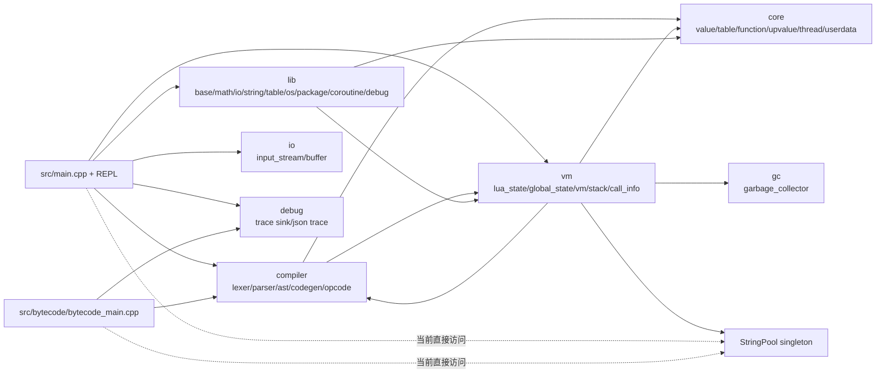
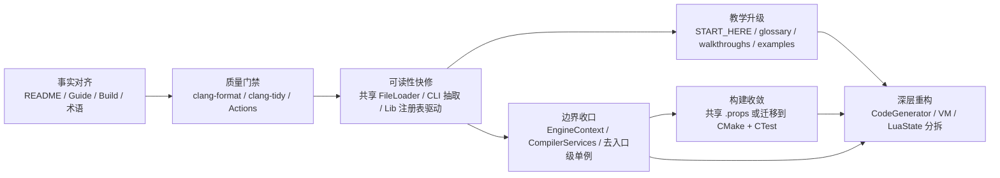

# YanqingXu/lua 仓库可读性、可扩展性与教学价值优化研究报告

## 执行摘要

本次研究以 GitHub 连接器对私有仓库 `YanqingXu/lua` 的静态扫描为主，并辅以官方/原始外部资料核对。综合判断，这个仓库**不是普通的 Lua 脚本仓库**，而是一个以 C++ 重写 Lua 5.1.5 解释器的学习型—工程型混合项目：它拥有清晰的目录分层、数量可观的中文设计文档、较完整的编译器/VM/标准库实现，以及一个覆盖面不错的测试体系；但与此同时，它也存在典型的“学习型项目长成工程后”的结构性问题：**文档与实现开始漂移、若干核心文件过大、单例与入口级耦合偏重、重复代码与构建配置重复逐渐积累**。这些问题不会立刻阻止功能继续演进，但会显著提高后续的维护成本、贡献门槛和教学解释成本。fileciteturn57file0 fileciteturn43file0 fileciteturn44file0 fileciteturn34file0 fileciteturn39file0 fileciteturn40file0

如果只抓最重要的三件事，我的结论是这样的。第一，这个项目**最强的资产不是代码本身，而是“已经存在的大量中文解释性材料”**：README、开发指南、字节码设计说明、渐进式重构清单，都说明作者有很强的教学意识，这一点极其难得。第二，目前可读性的主要障碍**不是注释太少，而是注释太多且开始失真**；例如 README 已说明 `ExprDesc / ExprKind` 从产品代码中移除，而 `docs/BYTECODE_GENERATION.md` 仍将 `ExprDesc` 作为理解主轴；`docs/DEVELOPMENT_GUIDE.md` 又以 CMake/ctest、Linux/macOS 作为标准工作流，但实际可见的构建入口是 `.vcxproj` 系列文件。第三，可扩展性的最大阻力来自**单例化运行时服务与超大核心模块**：`GlobalState`、`StringPool` 的单例式用法，加上 `CodeGenerator`、`VM`、`LuaState` 的“大类/大文件”趋势，使得“继续加功能”尚可，但“变换架构、支持多运行时、支持更强嵌入/工具链”会越来越贵。fileciteturn57file0 fileciteturn45file0 fileciteturn46file0 fileciteturn27file0 fileciteturn21file0 fileciteturn20file0 fileciteturn22file0 fileciteturn23file0 fileciteturn39file0 fileciteturn40file0

从优先级看，我建议先做**低风险高收益的“事实对齐 + 可读性快修”**：统一 README、开发指南、构建入口与术语；引入自动格式化/静态检查/CI；抽出重复的文件读取与 CLI 解析；把标准库注册从重复包装器改为声明式注册。随后，再进入**中风险但回报很高的“去单例化与边界清理”**：让编译服务和运行时服务通过上下文对象注入，而不是从 `main.cpp`、`bytecode_main.cpp` 等入口直接调用 `StringPool::getInstance()`。只有在这些基础设施到位之后，才值得启动大规模的 `CodeGenerator` / `VM` / `LuaState` 深拆工程。fileciteturn29file0 fileciteturn30file0 fileciteturn37file0 fileciteturn55file0 fileciteturn41file0 fileciteturn61file0

下表给出一个总览判断，便于快速抓住重点。该判断基于 README 的模块规模、自带设计文档、关键头/源文件抽样和工程文件扫描。fileciteturn57file0 fileciteturn27file0 fileciteturn43file0 fileciteturn44file0 fileciteturn34file0 fileciteturn47file0

| 维度 | 结论 | 核心原因 |
|---|---|---|
| 可读性 | 中上，但有明显漂移风险 | 目录与主题划分清晰，中文注释丰富；但长注释、日期/作者元数据、文档失真和局部重复代码开始削弱“真实可读性” |
| 可扩展性 | 中等，已出现架构改进萌芽 | `codegen_context`、`register_allocator`、`codegen_types` 等抽取已经开始，但单例服务与超大模块仍是主导 |
| 教学价值 | 高潜力，当前尚未完全兑现 | 文档很多，但缺“稳定学习路径”“示例工程”“按概念分层的阅读顺序” |
| 工具链成熟度 | 中低 | 仓库有较详细自述，但构建系统、测试框架依赖形态、CI/格式化/静态分析尚未收敛为外部贡献者可直接复现的流程 |

## 代码库概览

从仓库内容看，`YanqingXu/lua` 的主体语言是 **C++**，辅助材料包含 **Lua 测试/回归脚本**、**Markdown 中文文档**、**MSBuild XML 工程文件**，以及少量配置文件。README 将项目定位为“现代 C++ Lua 解释器”，自报代码规模约 87 个源文件、约 19k 行有效代码，并将平台明确标记为 Windows；同时，仓库中存在四个关键构建入口：`lua.vcxproj`、`lua_app.vcxproj`、`lua_bytecode.vcxproj`、`lua_test.vcxproj`，分别对应核心库、解释器应用、字节码工具和测试程序。fileciteturn57file0 fileciteturn21file0 fileciteturn22file0 fileciteturn23file0 fileciteturn20file0

按照实际源码与工程文件，可以将代码树近似概括为如下结构。这个树不是逐文件穷举，而是面向架构阅读的“有效视图”。其依据来自 README 的模块表、四个工程文件和测试/文档扫描结果。fileciteturn57file0 fileciteturn21file0 fileciteturn20file0 fileciteturn61file0

```text
YanqingXu/lua
├─ README.md
├─ lua.vcxproj                 # 核心库
├─ lua_app.vcxproj             # 解释器 / REPL
├─ lua_bytecode.vcxproj        # 字节码打印工具
├─ lua_test.vcxproj            # 单元测试可执行程序
├─ docs/
│  ├─ DEVELOPMENT_GUIDE.md
│  ├─ BYTECODE_GENERATION.md
│  ├─ COROUTINE_DESIGN_V2.md
│  ├─ PLAN.md
│  ├─ refactor_expdesc_pr_checklist.md
│  └─ refactor_singlepass_cleanup_plan.md
├─ src/
│  ├─ common/                  # types / config / macros
│  ├─ core/                    # value / table / function / string_pool / thread ...
│  ├─ gc/                      # garbage_collector
│  ├─ compiler/                # lexer / parser / ast / codegen / opcode ...
│  ├─ vm/                      # global_state / lua_state / stack / call_info / vm
│  ├─ lib/                     # baselib / mathlib / iolib / stringlib / debuglib ...
│  ├─ io/                      # input_stream / buffer
│  ├─ debug/                   # trace sink / json trace
│  ├─ bytecode/                # bytecode printer / tool entry
│  ├─ main.cpp                 # 解释器入口
│  └─ repl.cpp / repl.hpp
└─ tests/
   ├─ unit/
   │  ├─ compiler/
   │  ├─ core/
   │  ├─ metamethod/
   │  ├─ stdlib/
   │  ├─ vm/
   │  └─ framework/
   └─ lua/
      ├─ regressions/
      ├─ stdlib/
      └─ ...
```

从模块边界上看，仓库的“主题分层”是清楚的：`compiler` 负责前端与字节码生成，`core/gc/vm` 构成运行时和执行引擎，`lib` 放标准库，`io/debug/bytecode` 是辅助工具层，`tests` 与 `docs` 补足质量与教学材料。这种以目录表达职责的方式，对于中级 Lua 开发者非常友好，因为它与 Lua 官方手册的概念切片高度接近：值与类型、表、函数与 upvalue、字节码、标准库、调试与协程，几乎都能在目录层面一眼对应。fileciteturn57file0 fileciteturn32file0 fileciteturn39file0 fileciteturn47file0 citeturn2view0turn2view1

如果按“关键入口”而不是“目录”来理解仓库，最值得先读的文件有这些：`src/main.cpp` 是解释器启动与运行模式切换的总入口，`src/repl.hpp`/`repl.cpp` 负责交互模式，`src/compiler/codegen.hpp`/`.cpp` 与 `src/vm/vm.cpp` 是编译—执行链的核心，`src/vm/lua_state.hpp` 与 `src/vm/global_state.hpp` 是运行时状态的中心，`src/lib/lib_manager.hpp`/`.cpp` 和 `src/lib/lib_registry.hpp` 代表标准库装配层，而 `src/bytecode/bytecode_main.cpp` 暴露了一个非常适合教学演示的“只编译不执行”的观察窗口。fileciteturn29file0 fileciteturn31file0 fileciteturn43file0 fileciteturn44file0 fileciteturn34file0 fileciteturn47file0 fileciteturn39file0 fileciteturn37file0 fileciteturn63file0 fileciteturn55file0

从规模上看，复杂度热点已经非常集中。README 中最显著的热点包括：`CodeGenerator` 大约 2,249 行、`VM` 大约 2,030 行、`Parser` 大约 2,031 行、`LuaState` 大约 1,095 行，若再加上 `stringlib`、`debuglib`、`iolib` 等千行级标准库文件，说明这个仓库已经从“练手实现”进入“需要主动控制复杂度增长”的阶段。这里的关键不是文件行数本身，而是**单个模块同时承担了太多概念责任**：例如 `CodeGenerator` 既做名称绑定，又做寄存器分配、跳转回填、调用/多返回值处理和调试信息装配；`LuaState` 同时承担线程状态、栈 API、保护调用、hook 与根集相关责任。fileciteturn57file0 fileciteturn43file0 fileciteturn44file0 fileciteturn47file0

目前的模块依赖关系可以用下面这张图来概括。它展示的是**当前实现的主依赖方向**，同时也特意标出了一个重要问题：应用入口和字节码工具都直接碰到了字符串池单例，这会让“多运行时实例”“更强嵌入式 API”“更细粒度测试注入”变得很难。图中的关系来自 `main.cpp`、`bytecode_main.cpp`、`global_state.hpp`、`string_pool.hpp`、`codegen.hpp`、`vm.cpp` 与标准库装配层。fileciteturn29file0 fileciteturn55file0 fileciteturn39file0 fileciteturn40file0 fileciteturn43file0 fileciteturn34file0 fileciteturn37file0



构建与测试方面，仓库当前的“真实入口”是 MSBuild/Visual Studio 项目文件，而不是文档里宣称的 CMake。`lua_app.vcxproj` 与 `lua_bytecode.vcxproj` 都引用 `lua.vcxproj`；`lua_test.vcxproj` 以单独测试可执行程序编译大量 `tests/unit/*` 文件。README 自报当前有 414 个注册测试、1634 个断言结果全部通过，并强调“自定义轻量级测试框架（零外部依赖）”；但另一方面，测试适配层 `tests/unit/framework/test_framework.hpp` 又包含了 `test_framework/test_framework.hpp`，而 `lua_test.vcxproj` 还额外加入了 `lua_test\include` 头文件目录。这意味着测试框架的“零依赖”在叙述上是成立的，但在外部贡献者视角下，**依赖形态并不完全透明**，需要更明确的文档或直接 vendor 化。fileciteturn20file0 fileciteturn21file0 fileciteturn22file0 fileciteturn23file0 fileciteturn57file0 fileciteturn49file0

更重要的是，文档与构建事实已经出现偏差。`docs/DEVELOPMENT_GUIDE.md` 明确写了 CMake 3.15+、Linux/macOS 构建与 `ctest` 流程；但可见的工程入口是 `.vcxproj` 系列，README 也把平台标成 Windows，项目文件里不同配置还混用了 `stdcpp20` 与 `stdcpp23`。这说明仓库并非没有跨平台愿景，而是**愿景、文档与当前可复现构建入口还没有收敛成一套“对外可信的事实”**。这会直接影响新贡献者的第一印象。fileciteturn27file0 fileciteturn57file0 fileciteturn21file0 fileciteturn22file0 fileciteturn23file0 fileciteturn20file0

## 可读性诊断

这个仓库的可读性问题，并不是传统意义上的“代码太简略、什么都没写”，而恰恰相反：**它写了很多，而且写得很认真**。`README.md`、`DEVELOPMENT_GUIDE.md`、`BYTECODE_GENERATION.md`、`refactor_expdesc_pr_checklist.md` 都体现出很强的解释型写作习惯；`main.cpp`、`repl.hpp`、`value.hpp`、`types.hpp`、`global_state.hpp` 等关键文件也都有长篇头注释。对于首次进入仓库的人，这种写法能迅速降低陌生感。问题在于，**一旦项目规模增长，过密的说明性文本就会开始和实现脱节**，而脱节后的注释比缺注释更危险，因为它会让读者相信错误事实。fileciteturn57file0 fileciteturn27file0 fileciteturn46file0 fileciteturn45file0 fileciteturn29file0 fileciteturn31file0 fileciteturn32file0 fileciteturn33file0 fileciteturn39file0

最典型的漂移有两个。第一个是**构建事实漂移**：开发指南把 CMake/ctest 作为标准流程，但实际的入口是 MSBuild/`.vcxproj`。第二个是**概念文档漂移**：README 与重构清单都说明 `ExprDesc / ExprKind` 已从产品代码移除，而 `docs/BYTECODE_GENERATION.md` 仍大量围绕 `ExprDesc` 组织讲解。这不是说文档写错了，而是这些文档原本非常有价值，但现在缺少“版本边界”和“适用范围”标识。结果就是，初学者看完旧文档后会被迫重新建立心智模型。fileciteturn27file0 fileciteturn21file0 fileciteturn20file0 fileciteturn22file0 fileciteturn23file0 fileciteturn57file0 fileciteturn45file0 fileciteturn46file0

命名方面，项目有一个很鲜明的风格：**领域名词通常是好的，基础类型别名通常是有争议的**。`GlobalState`、`LuaState`、`FunctionRegistrar`、`RegisterAllocator`、`BlockManager`、`UpvalueContext` 这些名字都很清楚；但 `types.hpp` 和开发指南又强烈推动 `i32/u8/usize/Str/Vec/UPtr/Opt/Var` 这类全局别名，甚至明确提出“禁止直接使用原始类型”。对已经深度习惯该项目风格的作者来说，这是统一性的胜利；但对目标读者“中级 Lua 开发者”而言，他们更熟悉 Lua 语义而不是你这个仓库的别名系统，所以每一次看到 `Str`、`Vec`、`UPtr` 都要先做一层“翻译”。从教学价值角度说，这种翻译成本并不小。更务实的做法是：**保留整数宽度别名，但降低 STL 类型别名在公共接口中的出现频率**。fileciteturn27file0 fileciteturn33file0

复杂度热点方面，最大的问题不是某个函数写得“丑”，而是**多个核心文件同时在承担超额职责**。`codegen.hpp` 本身就暴露了极长的私有方法列表，覆盖指令生成、寄存器管理、常量池、局部变量、条件表达式、多返回值、LValue、跳转与函数编译等多个子系统；`vm.cpp` 采用“对齐 Lua C 版本的自由函数风格”，这在语义映射上很忠实，但也让一个文件同时装下 trace、hook、表操作、算术、比较和 opcode 分发；`lua_state.hpp` 则进一步承担了线程状态、栈 API、保护调用与调试 hook 等多重责任。站在阅读者角度，这意味着“知道从哪儿开始”并不等于“能在一个文件里安心追踪完一条责任链”。fileciteturn43file0 fileciteturn44file0 fileciteturn34file0 fileciteturn47file0

下表把最需要优先处理的可读性热点做了归纳。规模证据主要来自 README 的模块统计，责任/症状判断来自对关键头源文件的抽样阅读。fileciteturn57file0 fileciteturn43file0 fileciteturn44file0 fileciteturn34file0 fileciteturn47file0

| 热点 | 证据 | 可读性症状 | 建议方向 |
|---|---|---|---|
| `compiler/codegen.*` | README 约 2249 行；私有 API 极长 | 一个类同时解释太多概念，读者难建立层次 | 拆成 binder / lowering / bytecode builder |
| `vm/vm.cpp` | README 约 2030 行；自由函数帮助器密集 | 对语义忠实，但跨概念跳跃大 | 先按 opcode/主题拆文件，再统一调试与错误路径 |
| `compiler/parser.*` | README 约 2031 行 | 语法规则集中但追踪成本高 | 按表达式/语句/函数体拆分解析单元 |
| `vm/lua_state.*` | README 约 1095 行；30+ API 方法 | 线程状态、栈 API、保护调用混在一起 | 区分 “execution state” 与 “public stack API” |
| 中文文档体系 | 文档多且详尽 | 价值很高，但新旧并存且适用范围不明 | 为每篇文档加“适用版本/最后核对对象”页眉 |

重复代码是另一个被低估的问题。这里既有“文本重复”，也有“控制流重复”。例如 `lib_manager.cpp` 中的 `openBase/openMath/openIO/openString/...` 几乎全是同构包装器；而 `main.cpp` 和 `src/bytecode/bytecode_main.cpp` 中又分别实现了一套完整的“读文件到字符串”辅助函数。对当前仓库规模来说，这些重复似乎不大，但它们会把后续每一次行为细修都变成“想改一处，得检查三处”的维护模式，这正是项目迈向中型工程时最该提前拦住的信号。fileciteturn37file0 fileciteturn29file0 fileciteturn55file0

下面给出三个**小而具体**的重构补丁，目标不是“彻底重写”，而是展示怎样用低风险方式立即改善可读性。

当前 `StandardLibrary` 的包装器结构如下，几乎全是样板式空指针检查 + 单一调用。fileciteturn37file0 fileciteturn38file0

```cpp
void StandardLibrary::openBase(LuaState* L) {
    if (!L) {
        return;
    }
    openBaseLib(L);
}

void StandardLibrary::openMath(LuaState* L) {
    if (!L) {
        return;
    }
    openMathLib(L);
}

// ... openIO / openString / openTable / openOS / ...
```

一个更可读、也更易扩展的版本可以先不引入新架构，只做**表驱动化**：

```cpp
namespace {
using OpenFn = void (*)(LuaState*);

constexpr OpenFn kStdLibs[] = {
    openBaseLib,
    openMathLib,
    openIOLib,
    openStringLib,
    openTableLib,
    openOSLib,
    openCoroutineLib,
    openDebugLib,
    openPackageLib,
};
}

void StandardLibrary::openAll(LuaState* L) {
    if (!L) return;
    for (auto fn : kStdLibs) {
        fn(L);
    }
}

void StandardLibrary::openBase(LuaState* L)      { if (L) openBaseLib(L); }
void StandardLibrary::openMath(LuaState* L)      { if (L) openMathLib(L); }
// 若这些单模块入口仅供测试使用，可保留；否则可进一步收敛为 open(L, StdLib kind)
```

这类改动的价值不只在于删掉几十行代码，更重要的是把“标准库装配顺序”提升为一个显式数据结构，后面无论是做按库过滤、测试按需装载，还是生成文档列表，都容易许多。这个改动还可以自然衔接到仓库里已经存在的 `LibModule` 和 `FunctionRegistrar` 抽象，而不是另起炉灶。fileciteturn62file0 fileciteturn63file0

第二个补丁点是文件读取逻辑。当前 `main.cpp` 与 `bytecode_main.cpp` 各自维护了一套近乎平行的实现。fileciteturn29file0 fileciteturn55file0

```cpp
// src/main.cpp
Str readFileContents(const char* filename) {
    std::ifstream file(filename, std::ios::binary | std::ios::ate);
    ...
}

// src/bytecode/bytecode_main.cpp
static std::string readFile(const char* path) {
    std::ifstream in(path, std::ios::binary);
    ...
}
```

建议直接抽出一个真正共享的 I/O 辅助层，例如：

```cpp
// src/io/file_loader.hpp
#pragma once
#include "common/types.hpp"
#include <filesystem>

namespace Lua {
Str readWholeFile(const std::filesystem::path& path);
}

// src/io/file_loader.cpp
#include "io/file_loader.hpp"
#include <fstream>
#include <sstream>
#include <stdexcept>

namespace Lua {
Str readWholeFile(const std::filesystem::path& path) {
    std::ifstream in(path, std::ios::binary | std::ios::ate);
    if (!in) {
        throw std::runtime_error("cannot open " + path.string());
    }
    const auto size = in.tellg();
    in.seekg(0, std::ios::beg);

    Str out(static_cast<usize>(size), '\0');
    if (!in.read(out.data(), size)) {
        throw std::runtime_error("error reading " + path.string());
    }
    return out;
}
}
```

随后，`main.cpp` 与 `bytecode_main.cpp` 都调用 `readWholeFile()`。这不仅消除了重复，更让“读文件失败的语义”“是否二进制安全”“之后是否支持 memory-mapped file”拥有了统一位置。对教学来说，这也使“解释器入口”和“字节码工具入口”更专注于自身职责，而不是夹带 I/O 杂事。fileciteturn29file0 fileciteturn55file0

第三个补丁点是 `main.cpp` 的命令行解析与运行模式切换。当前 `main()` 内部同时完成 UTF-8 初始化、参数扫描、状态机创建、trace sink 设置、脚本模式/REPL/默认脚本分支与异常兜底。虽然注释很详细，但这其实是一个标准的“应当拆成 `parseArgs + run` 两阶段”的入口函数。现状片段如下。fileciteturn30file0

```cpp
bool showVersion = false;
bool showHelp = false;
bool interactiveMode = false;
const char* scriptFile = nullptr;
const char* traceFile = nullptr;
i32 scriptIndex = -1;

for (i32 i = 1; i < argc; ++i) {
    if (std::strcmp(argv[i], "-v") == 0) {
        showVersion = true;
    } else if (std::strcmp(argv[i], "-h") == 0) {
        showHelp = true;
    } else if (std::strcmp(argv[i], "-i") == 0) {
        interactiveMode = true;
    } else if (std::strcmp(argv[i], "--trace") == 0 && i + 1 < argc) {
        traceFile = argv[++i];
    } else if (argv[i][0] != '-') {
        scriptFile = argv[i];
        scriptIndex = i;
        break;
    }
}
```

更好的方式是显式定义读者能一眼看懂的应用层模型：

```cpp
enum class RunMode {
    ShowVersion,
    ShowHelp,
    Repl,
    Script,
    DefaultBehavior
};

struct AppOptions {
    RunMode mode = RunMode::DefaultBehavior;
    const char* scriptFile = nullptr;
    const char* traceFile = nullptr;
    i32 scriptIndex = -1;
};

AppOptions parseArgs(int argc, char** argv);
int runApp(const AppOptions& opt);
```

这类抽取看似只是“把代码搬一搬”，但它对阅读体验的提升非常大：以后任何人想看“支持哪些 CLI 参数”“默认行为是什么”“trace 在什么情况下启用”，都不用再在一个 200+ 行的 `main()` 中穿梭。对教学文档来说，它还能直接生成一张简单的模式状态图。fileciteturn29file0 fileciteturn30file0

## 可扩展性诊断

从可扩展性角度看，这个仓库其实已经暴露出两种相反力量。一方面，作者已经开始主动“拆职责”：`codegen_context.hpp` 把局部变量作用域、upvalue、block 管理从 `CodeGenerator` 里抽了出去；`register_allocator.hpp` 也单独提炼了寄存器分配职责；`codegen_types.hpp` 进一步把 `PatchList`、`CondResult`、`ValueResult`、`LValueRef`、`CallResultInfo`、`SymbolRef` 变成了中间边界对象。另一方面，这些抽取**仍然带着很强的兼容式过渡痕迹**，比如 `LocalVarScope`、`UpvalueContext`、`BlockManager` 仍然公开内部字段以兼容旧代码。这说明仓库已经在走向更好的模块化，但还没有完成“真正意义上的边界收口”。fileciteturn41file0 fileciteturn42file0 fileciteturn48file0

最核心的扩展瓶颈，是**运行时服务的隐式全局化**。`GlobalState` 明确以单例模式管理字符串池、GC、注册表与元表；`StringPool` 本身也是单例；而在应用和工具入口里，又存在直接拿 `StringPool::getInstance()` 来构造 `CodeGenerator` 的做法。这会产生两个具体后果。其一，编译链难以自然接入“多运行时上下文”或“嵌入式宿主自己提供服务”；其二，想做更彻底的单元测试或隔离式测试时，编译器状态与运行时状态之间的边界会变得模糊。对一个解释器项目来说，这种设计在早期很省事，但一旦你想做多实例、沙箱、插件式工具链，它就会成为最先卡住你的地方。fileciteturn39file0 fileciteturn40file0 fileciteturn29file0 fileciteturn55file0

第二个瓶颈是**编译器子系统的超强聚合**。`CodeGenerator` 虽然已经吸收了提取后的上下文与结果类型，但其 public/private API 仍然横跨名称绑定、Value/LValue/Cond 三种通道、调用与多返回值、跳转回填、block 管理与子函数编译等多个阶段。换句话说，它更像一个“编译总控类”，而不是职责单一的 bytecode builder。仓库自己的 `docs/PLAN.md` 其实已经给出更先进的愿景：把 `Parser / Semantic / HIR / Lowering / VM / Runtime` 分层，并引入更工程化的 include/src/examples/docs 布局。我的建议不是马上实现那份蓝图，而是把它当成“北极星”，用来判断哪些重构是在向目标靠近，哪些只是局部重排。fileciteturn43file0 fileciteturn44file0 fileciteturn61file0

第三个瓶颈是**装配层抽象存在，但没有被统一采用**。一方面，仓库已经有 `LibModule` 这个接口，以及 `FunctionRegistrar` 这个批量注册/流式注册工具；另一方面，`StandardLibrary` 依然主要通过一组 `openX()` 包装器去手动调用自由函数。这说明你已经拥有“声明式标准库装配”的一半基础设施，但还没有让它成为唯一主路径。可扩展性的一个常见原则是：**不要同时维护两个平行的扩展机制**。这里理想的方向是，标准库全部实现为可枚举的 `LibModule` 描述对象，然后由一个统一的 catalog 决定默认加载顺序、按需装载、测试装配和文档生成。fileciteturn62file0 fileciteturn63file0 fileciteturn37file0 fileciteturn38file0

第四个瓶颈是**构建系统与配置重复会反过来伤害架构扩展**。当前四个 `.vcxproj` 文件分别维护多组目标平台、语言标准、包含目录与链接关系，且配置存在不一致。这种方式在项目只有一个平台、一个作者时还能忍受，但一旦你想引入 GitHub Actions 矩阵构建、clang-tidy、CodeQL、跨平台构建或外部用户复现，构建层的重复就会迅速放大为架构演进障碍。对于这类仓库，我通常不建议“先上 CMake 再说”，而是建议先明确两步：**短期抽共享 `.props`，中期落到 CMake + CTest**。这样不会打断现有 VS 工作流。fileciteturn21file0 fileciteturn22file0 fileciteturn23file0 fileciteturn20file0 fileciteturn27file0

下面这张表把扩展性问题与建议的接口化方向集中展示出来。它的核心不是让你“推倒重来”，而是让后续功能开发逐步从隐式依赖转向显式边界。fileciteturn39file0 fileciteturn40file0 fileciteturn41file0 fileciteturn42file0 fileciteturn43file0 fileciteturn61file0

| 当前瓶颈 | 现象 | 影响 | 更合适的接口设计 |
|---|---|---|---|
| 运行时服务单例化 | `GlobalState` / `StringPool` 是单例，入口直接取实例 | 多实例、嵌入、可替换服务困难 | `EngineContext` / `RuntimeServices` 显式注入 |
| 编译器总控类过大 | `CodeGenerator` 集中处理太多阶段 | 新功能常需跨很多私有 helper 修改 | `NameBinder` + `LoweringContext` + `ProtoBuilder` |
| 标准库装配双轨制 | 既有 `LibModule`/`FunctionRegistrar`，又有手写包装器 | 新库接入方式不统一，文档难自动生成 | `StdLibCatalog` 统一声明式注册 |
| 构建配置重复 | 四个 `.vcxproj` 各自维护配置 | 跨平台/CI/静态分析接入成本高 | 共享 `.props`，随后迁移 CMake/CTest |
| 教学与工程边界混杂 | 头文件承载大量设计论文式注释 | 维护时难判断“谁是代码事实、谁是解释材料” | 把原则/背景移入 `docs/`，头文件只保留 API 契约 |

我建议的中期接口方向可以用下面的伪代码来表达。这个设计并不要求你立刻引入 HIR 或重写 VM；它只是把当前已经散落在单例和入口函数里的服务关系收拢到显式对象中。该建议是基于 `GlobalState` 现有职责、`CodeGenerator` 构造方式、`LibModule`/`FunctionRegistrar` 接口和 `PLAN.md` 的分层蓝图所做的工程推断。fileciteturn39file0 fileciteturn29file0 fileciteturn55file0 fileciteturn62file0 fileciteturn63file0 fileciteturn61file0

```cpp
struct EngineContext {
    StringPool& strings;
    GarbageCollector& gc;
    Table* registry;
    MetatableRegistry& metatables;
};

struct CompileArtifact {
    Proto* proto = nullptr;
    DiagnosticSet diagnostics;
};

class CompilerFacade {
public:
    explicit CompilerFacade(EngineContext& ctx) : ctx_(ctx) {}
    CompileArtifact compile(StrView source, StrView sourceName);

private:
    EngineContext& ctx_;
};

class StdLibCatalog {
public:
    void openAll(LuaState& L);
    void openOnly(LuaState& L, std::span<const StdLibId> enabled);
};
```

如果你愿意把仓库自己的 `PLAN.md` 作为长期目标，那么一个合理的扩展路径不是直接引入 HIR，而是先完成四件更现实的工作：**去除入口级别的单例直连、统一标准库注册、让 `CodeGenerator` 的抽取类真正封装起来、让构建系统为 CI/静态分析生成稳定编译数据库**。这四件事做完之后，再谈 HIR、优化器、JIT、LSP、AOT，成功率会高得多。fileciteturn61file0 fileciteturn41file0 fileciteturn42file0

## 教学与文档增强

单纯从“教学潜力”出发，这个仓库其实比大多数解释器重写项目更有优势。因为它已经具备三种别人常常没有的材料：一是 README 中按模块给出的进度、缺失特性和实现亮点；二是面向实现者的中文开发指南；三是围绕字节码生成和渐进式重构写成的设计文档与 PR 清单。换句话说，这个项目已经不缺“知识”，缺的是**将这些知识组织成稳定学习路径的产品化能力**。fileciteturn57file0 fileciteturn27file0 fileciteturn46file0 fileciteturn45file0

目前教学价值的主要损耗，来自三个地方。第一，文档很多，但**读者不知道先读哪一篇**。第二，文档和代码之间缺乏一条始终一致的“概念映射线”，例如 Lua 官方术语中的 `registry`、`Proto`、`upvalue`、`RK`、`environment`、`tail call`，虽然在仓库里都有对应实现，但这些对应关系没有被集中成 glossary。第三，仓库里有大量测试和一个字节码工具入口，但**没有真正对外的 `examples/` 示例项目**；而 `PLAN.md` 恰恰又把 `examples/` 目录写进了理想结构中，这说明作者自己其实也意识到了这一缺口。fileciteturn57file0 fileciteturn46file0 fileciteturn55file0 fileciteturn61file0

对目标受众“中级 Lua 开发者”来说，最有效的教学升级不是再写一份“大而全的架构文档”，而是建立一个**分层阅读路线**：先让读者站在 Lua 语言概念上理解“值、表、函数、闭包、协程、标准库、字节码”，再把这些概念逐个映射到仓库文件。Lua 官方手册本身就是语言定义的权威入口，而 Roberto Ierusalimschy 的 *Programming in Lua* 则更适合做“为什么是这样”的解释。你完全可以把仓库文档变成一个“官方手册 -> PiL -> 仓库文件”的三段式桥梁。citeturn2view0turn2view1

例如，完全可以在 `docs/START_HERE.md` 中写出这样的阅读顺序：  
先读 Lua 5.1 手册里的 “Values and Types / Expressions / Metatables / Coroutines / Standard Libraries”，再读 `src/core/value.hpp`、`src/core/table.*`、`src/core/function.*`、`src/core/upvalue.*`、`src/vm/vm.cpp` 对应实现；然后用 `src/bytecode/bytecode_main.cpp` 看看 AST 是如何变成 `Proto` 的，再回到 `docs/BYTECODE_GENERATION.md` 理解设计取舍。这样一来，仓库文档就不是与官方资料平行竞争，而是成为官方资料的“项目内导航层”。citeturn2view0turn2view1 fileciteturn32file0 fileciteturn34file0 fileciteturn55file0 fileciteturn46file0

我建议优先补齐以下几类教学工件。下表的判断依据来自当前 docs 体系、README、测试文件分布、字节码工具入口，以及官方 Lua 手册/PiL 对概念切分的方式。fileciteturn57file0 fileciteturn45file0 fileciteturn55file0 citeturn2view0turn2view1

| 建议工件 | 目标读者 | 推荐内容 | 预期收益 |
|---|---|---|---|
| `docs/START_HERE.md` | 第一次进入仓库的人 | 阅读顺序、术语表、必读文件 | 降低“我该先读哪里”的摩擦 |
| `docs/glossary.md` | 中级 Lua 开发者 | Lua 术语 ↔ 仓库类/文件/函数映射 | 建立稳定心智模型 |
| `docs/walkthroughs/` | 想深入源码的人 | `表达式 -> AST -> Proto -> VM` 逐步演示 | 将复杂实现变成可复用教程 |
| `examples/` | 想快速验证功能的人 | closure、metatable、coroutine、module、generic for 等小脚本 | 把“测试”变成“学习入口” |
| `docs/compatibility/lua51.md` | 维护者与用户 | 按官方手册章节列出“支持/部分支持/缺失” | 减少 README 中大段兼容性文字的搜索负担 |
| `docs/contributing/testing.md` | 新贡献者 | 如何运行测试、如何新增回归、如何解释失败 | 把测试从内部知识变成公共流程 |

在函数级文档上，我不建议继续增加类似 `@author`、`@date` 这类维护型元信息；更有教学价值的是**API 契约注释**，也就是回答四个问题：这个函数做什么、输入预期是什么、会产生什么副作用、它在 Lua 语义上对应哪一节。Doxygen 和 Sphinx 系统都支持这种写法，而且 Doxygen 本身除了 API 文档外，也可以生成“额外说明页”；Sphinx 则擅长交叉引用、HTML/PDF 多格式输出；Breathe 则能把 Doxygen XML 接起来，让 narrative docs 和 API docs 成为一体。对这种“解释器源码 + 中文讲义”的仓库，它们非常合适。citeturn10view5turn4view1turn10view6

一个更适合教学的注释模板，大概像这样：

```cpp
/// @brief 将 AST 顶层 chunk 编译为 Lua 5.1 Proto。
/// @pre  parser 已成功生成语法正确的 AST；ctx.strings 可用。
/// @post 返回的 Proto 已包含指令、常量表、行号与子 Proto 信息。
/// @sideeffects 可能向常量表、upvalue 名称表和局部变量表追加调试元数据。
/// @see Lua 5.1 Reference Manual §2.5, §2.6, §5
Proto* generate(const Chunk& chunk, StrView sourceName = {});
```

这种注释比“大段设计论文式头注释”更容易长期维护，因为它真正贴近接口契约；更深入的推导过程则完全可以放到 `docs/walkthroughs/` 中。citeturn2view0turn2view1turn10view5turn4view1turn10view6

最后，测试完全可以从“验证工具”升级为“教学材料”。仓库已经有非常好的测试切片，比如 `test_symbol_binding`、`test_codegen_conditions`、`test_codegen_multret`、`test_value_pipeline`、`test_lvalue_pipeline`、`test_call_pipeline` 等，这些名字本身就已经是一门课程的大纲。我的建议不是把测试重写成教程，而是挑 10~15 个最关键测试，写成“带注释的 walkthrough test”，并在文档中明确告诉读者：**如果你想理解短路求值、多返回值、符号绑定、元方法，请先从这些测试开始。** 这会大大提高教育性回报。fileciteturn45file0 fileciteturn54file15 fileciteturn54file18 fileciteturn54file24 fileciteturn54file20 fileciteturn54file23 fileciteturn54file28

## 工具链与质量门禁

对于这个仓库，工具链的目标不应是“上很多工具”，而应是**让事实自动化，让风格自动化，让漂移可见**。也就是说，工具链首先要解决的是：格式由机器统一、静态问题尽早暴露、构建入口对外可复现、文档与代码之间有自动链接、测试结果可在 CI 中稳定展示。官方资料已经非常清楚地支持这种组合：`clang-format` 可以通过仓库级 `.clang-format` 配置和 `git clang-format` 只格式化改动行；`clang-tidy` 提供 `bugprone`、`performance`、`portability`、`readability`、`cppcoreguidelines` 等检查并支持自动修复；GitHub Actions 是仓库内原生 CI 平台；CodeQL 可直接分析 C/C++；MSVC 的 AddressSanitizer 能发现堆/栈溢出、use-after-free、double free 等问题；CTest 可以统一跑测试并输出 JUnit；Doxygen、Sphinx、Breathe 则恰好覆盖 API 文档与叙事文档的双轨需求。citeturn3view0turn3view2turn7view4turn7view2turn7view1turn9view0turn10view5turn4view1turn10view6

如果只给一套“最小但够用”的建议栈，我会这样配。下表的推荐基于官方文档能力与当前仓库形态共同判断。citeturn3view0turn3view2turn7view4turn7view2turn7view1turn9view0turn10view5turn4view1turn10view6

| 类别 | 最低建议 | 增强建议 | 为什么适合这个仓库 |
|---|---|---|---|
| 格式化 | `clang-format` + `.clang-format` | `git clang-format` 只格式化改动行 | 解决 `main.cpp` 这类人工风格漂移，不再靠 review 挑空格 |
| 静态检查 | `clang-tidy` | 分阶段启用 `readability-*`, `bugprone-*`, `performance-*`, `portability-*`, `cppcoreguidelines-*` | 直接对应本仓库的可读性、Bug 风险和可移植性问题 |
| 内存/未定义行为检查 | MSVC ASan Debug 构建 | 后续再补 Clang/GCC Sanitizers | GC、Table、Function、VM 都是高风险内存区 |
| 安全扫描 | GitHub CodeQL for C/C++ | 自定义 query/pack | 适合解释器这类指针密集、控制流复杂项目 |
| CI | GitHub Actions | 后续加 matrix、artifact、docs 发布 | 仓库内原生工作流，更适合私有仓库和 PR 审阅 |
| 测试编排 | 现有 runner 先保留 | 中期转 CTest/输出 JUnit | 先不打断现有测试资产，再逐步改进结果整合 |
| 文档 | Doxygen 先覆盖 API | Sphinx + Breathe 覆盖课程化文档 | 既保留源码注释，又能做高质量教程与导航 |

在测试框架上，我不建议立刻大迁移。原因很简单：当前仓库已经沉淀了不少测试资产，贸然换框架很容易把本该花在架构重构上的精力消耗在“重写测试胶水代码”上。更合理的是先把**报告能力和可集成性**补起来，比如 JUnit/XML、标签分组、失败重跑，再决定是否迁移。官方资料显示，Catch2 的优势在于上手快、无外部依赖、支持 sections 和 JUnit XML；doctest 的优势在于单头文件、编译开销轻、测试可以直接靠近生产代码并兼做文档；GoogleTest 则是功能最稳定、mock/fixture 能力最强。相比之下，当前自定义框架的优势是你已经拥有它，缺点是外部生态与工具整合能力较弱。fileciteturn49file0 fileciteturn57file0 citeturn10view1turn10view2turn10view3turn10view4turn10view0

因此，我的框架建议是分层的。短期内，**保留当前自定义框架**，但给它补上 CI 可消费的结果输出；如果你希望 tests 更有“教学材料”属性，那么 **doctest** 很有吸引力，因为它明确强调测试可直接放在生产代码附近，并把测试视作文档的一部分；如果你更重视 CI 友好性和分组运行，则 **Catch2** 是更折中的选择；只有当仓库开始大量依赖 mock、fixture、复杂 matcher 时，才值得考虑 **GoogleTest**。fileciteturn49file0 citeturn10view3turn10view4turn10view1turn10view2turn10view0

一个务实的 CI 方案可以是这样的。第一层是 PR 必跑：MSBuild Debug x64、`clang-format --dry-run`、一组保守的 `clang-tidy` 检查、`lua_test`、核心 Lua regressions。第二层是 nightly：ASan、CodeQL、文档构建检查。等仓库转到 CMake 后，再用 CTest 统一导出 JUnit/XML 与标签化测试。GitHub Actions 原生支持仓库内工作流，CTest 也支持并行运行、按 label 过滤和 JUnit 输出，这正好能够把“当前已有的丰富测试”变成“CI 中可管理的测试产品”。citeturn7view4turn7view5turn7view2turn7view1turn9view0

## 优先行动路线图

下面这份路线图遵循一个原则：**先清理事实和边界，再做深层重构**。原因很直接：如果 README、开发指南、工程文件、自动格式化和测试结果都还没有统一，那么任何大的结构重写都会被“仓库外观不可信”这件事拖慢。相反，只要先把文档/构建/CI/重复代码清理到位，后续对 `CodeGenerator`、`VM`、`LuaState` 的大拆分就会安全得多。路线图的优先级判断基于当前文档漂移、重复代码点、单例耦合和核心文件规模。fileciteturn27file0 fileciteturn57file0 fileciteturn37file0 fileciteturn29file0 fileciteturn55file0 fileciteturn39file0 fileciteturn43file0 fileciteturn34file0

| 优先级 | 行动 | 预期收益 | 预计工作量 | 风险 |
|---|---|---|---|---|
| 最高 | 对齐 README、DEVELOPMENT_GUIDE、工程入口与术语；标出哪些文档已过时/适用何版本 | 立即降低误导和新人摩擦 | 2–4 天 | 低 |
| 最高 | 引入 `clang-format`、基础 `clang-tidy`、GitHub Actions PR 工作流 | 让风格和明显问题自动化暴露 | 3–5 天 | 低 |
| 高 | 抽出共享文件读取、CLI 解析、标准库表驱动注册 | 删除低价值重复代码，提升入口可读性 | 3–6 天 | 低 |
| 高 | 为现有测试 runner 增加机器可读输出；整理“关键测试即教程”索引 | 不换框架也能形成 CI 与教学闭环 | 3–5 天 | 低 |
| 中高 | 引入 `EngineContext/CompilerServices`，停止入口层直接调用 `StringPool::getInstance()` | 为多实例、嵌入和可测试性打开空间 | 1–2 周 | 中 |
| 中高 | 统一标准库装配为 `LibModule` / catalog 主路径 | 让新库接入、按需装载和文档生成一致化 | 4–7 天 | 中 |
| 中 | 把 `examples/`、`START_HERE`、`glossary`、`walkthroughs` 补齐 | 教学价值明显上升 | 1–2 周 | 低 |
| 中低 | 迁移到 CMake + CTest，保留 VS 友好入口 | 让 CI、静态分析、跨平台更自然 | 1–2 周 | 中 |
| 长期 | 深拆 `CodeGenerator`、`VM`、`LuaState` | 真正提升长线可扩展性 | 2–6 周 | 高 |

如果要用一句话概括顺序，那就是：**先让仓库“可信”，再让仓库“优雅”**。所谓“可信”，是指外部读者看到的 README、开发文档、工程文件、代码风格、CI 结果彼此一致；所谓“优雅”，才是去单例化、拆层、引入更理想的编译中间层结构。这个项目已经有相当好的“优雅愿景”，缺的是把它和“可信仓库表面”接起来。`docs/PLAN.md` 恰好可以作为长期 north star。fileciteturn61file0

下面这张时间流图给出我建议的执行节奏。这里没有假定固定外部 deadline，因此用的是“先后顺序 + 并行窗口”而不是绑定具体周历。fileciteturn57file0 fileciteturn61file0



我特别建议把“深层重构”分成**两轮**。第一轮只做边界封装，不动语义；第二轮才做真正的拆分和抽象提升。仓库自己的 `refactor_expdesc_pr_checklist.md` 已经证明作者擅长用分阶段 PR 方式推进复杂重构，这种方法论应该继续沿用到后续的运行时与 VM 清理中。fileciteturn45file0

## 参考来源

本报告中的仓库结论主要来自以下仓库内证据：README 与模块/兼容性统计、开发指南、字节码生成说明、长期架构蓝图、渐进式重构清单、四个 `.vcxproj` 工程文件，以及对 `main.cpp`、`bytecode_main.cpp`、`value.hpp`、`types.hpp`、`global_state.hpp`、`lua_state.hpp`、`vm.cpp`、`codegen.hpp`、`codegen_context.hpp`、`register_allocator.hpp`、`lib_manager.*`、`lib_module.hpp`、`lib_registry.hpp`、测试适配层等关键文件的抽样阅读。fileciteturn57file0 fileciteturn27file0 fileciteturn46file0 fileciteturn61file0 fileciteturn45file0 fileciteturn21file0 fileciteturn22file0 fileciteturn23file0 fileciteturn20file0 fileciteturn29file0 fileciteturn55file0 fileciteturn32file0 fileciteturn33file0 fileciteturn39file0 fileciteturn47file0 fileciteturn34file0 fileciteturn43file0 fileciteturn41file0 fileciteturn42file0 fileciteturn37file0 fileciteturn62file0 fileciteturn63file0 fileciteturn49file0

外部方法与工具建议主要参考以下官方/原始资料：Lua 5.1 Reference Manual 与 *Programming in Lua*，用于建立语言语义与仓库教学导航；LLVM 官方 `clang-format` / `clang-tidy` 文档，支持格式化与静态检查建议；GitHub Actions 与 CodeQL 官方文档，支持 CI 与安全扫描建议；Microsoft AddressSanitizer 文档，支持内存安全检查建议；CMake/CTest 官方文档，支持后续测试编排与 JUnit 输出建议；Doxygen、Sphinx、Breathe 官方文档，支持 API 文档与叙事文档合流建议；GoogleTest、Catch2、doctest 官方资料，用于测试框架选型比较。citeturn2view0turn2view1turn3view0turn3view2turn7view4turn7view2turn7view1turn9view0turn10view5turn4view1turn10view6turn10view0turn10view1turn10view2turn10view3turn10view4